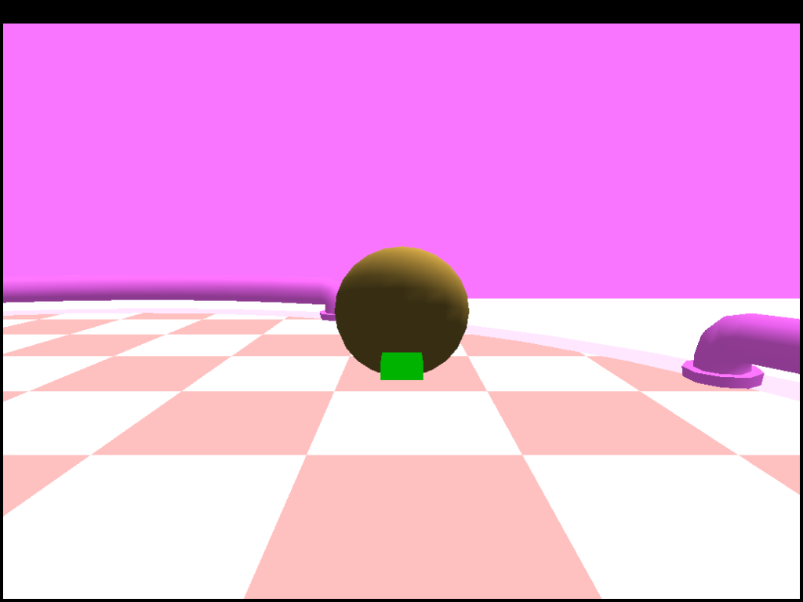

# Hamsterball — Open-Source Reimplementation

Reverse-engineered, clean-room reimplementation of **Hamsterball** (2004, Raptisoft).
Loads original MESHWORLD levels and runs on Windows (MinGW) and Linux (Wine + Xvfb).

⚠️ **Very early stage.** Track geometry renders with flat vertex colors. No textures, no
transparency, no HUD, no menu, no audio in-game yet.



*Best current render — WarmUp track geometry with per-geom material colors (solid shading only).*

## What Works

| System | Status | Notes |
|---|---|---|
| MESHWORLD parser | ✅ | All 6 sections + strings |
| Geometry rendering | ✅ | Flat shaded, no textures |
| Ball movement | ✅ | Arrow keys only |
| Collision | ✅ | Sphere vs level triangles |
| Camera | ✅ | Isometric follow |

## What Doesn't Work Yet

- Textured walls/floors
- Ball glass / visible hamster inside
- HUD, timer, score
- Start pad / GO arrow
- Menu system
- Audio playback in game
- Particle effects
- Any visual parity with original

## Build

```bash
cd reimpl
make -f Makefile.mingw
```

Run on Linux:
```bash
Xvfb :99 -screen 0 1280x720x24 &
DISPLAY=:99 LIBGL_ALWAYS_SOFTWARE=1 wine hamsterball.exe
```

## Architecture Docs

- [`docs/BALL_PHYSICS_DECOMP.md`](docs/BALL_PHYSICS_DECOMP.md) — Ball physics
- [`docs/CAMERA_SYSTEM.md`](docs/CAMERA_SYSTEM.md) — Camera decomp
- [`docs/MESHWORLD_BINARY_FORMAT_OFFICIAL.md`](docs/MESHWORLD_BINARY_FORMAT_OFFICIAL.md) — Official file format
- [`docs/INPUT_SYSTEM.md`](docs/INPUT_SYSTEM.md) — Verified input (arrows only)
- [`docs/RENDERING_ITERATION_LOG.md`](docs/RENDERING_ITERATION_LOG.md) — Rendering experiments

## Repos

- **Public** (this repo) — source only
- **Private** — source + original `.exe`/`.dll`/`.mo3`/assets

## License

Reimplementation code is original. Original Hamsterball assets are copyright their
respective owners and are not distributed here.
