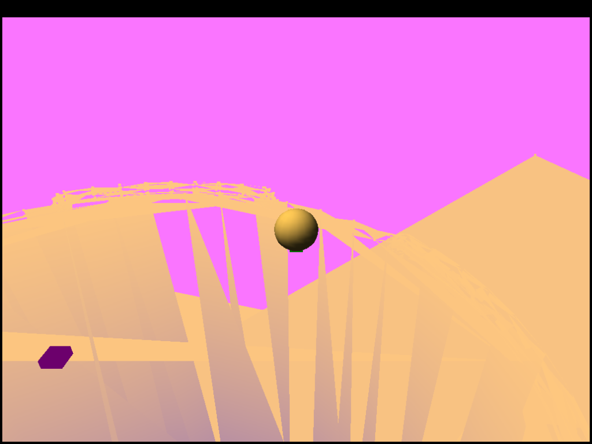
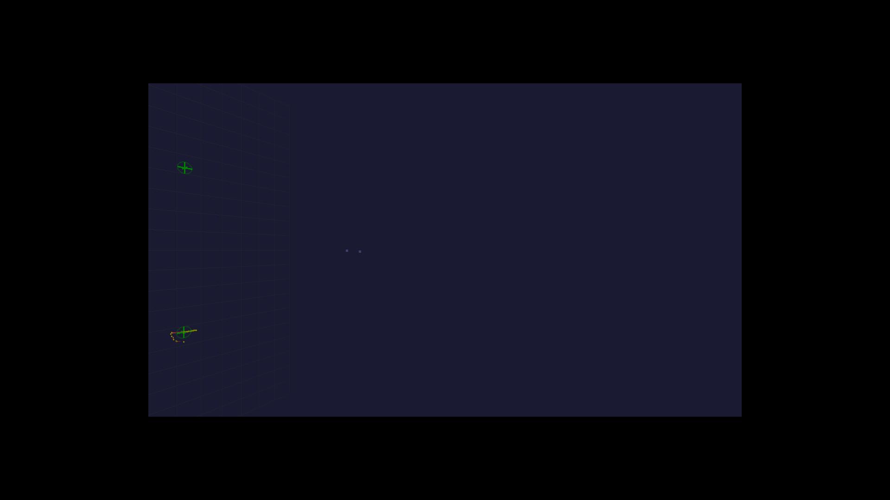
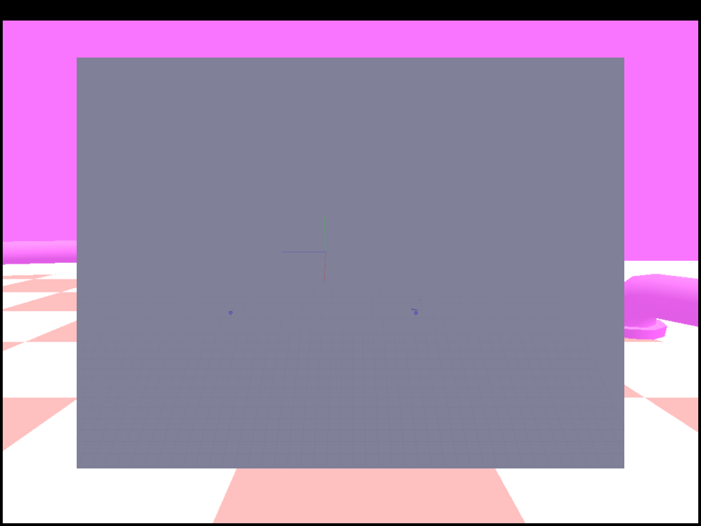
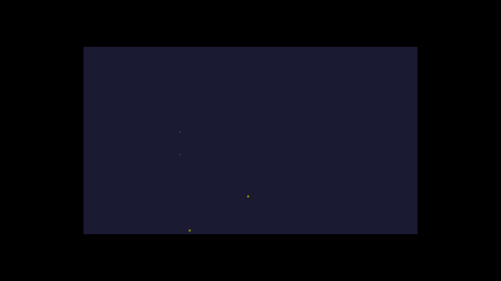
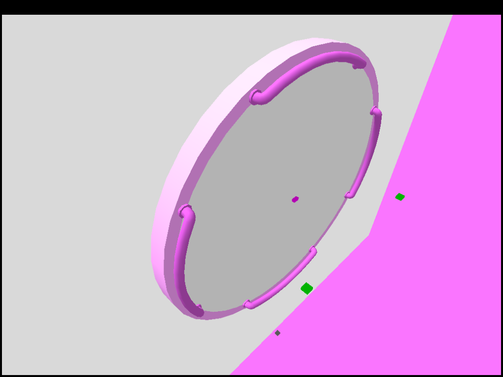

# Hamsterball — Open-Source Reimplementation

Reverse-engineered, clean-room reimplementation of **Hamsterball** (2004, Raptisoft) in C using Direct3D 8.
Loads original assets (levels, textures, sounds) and recreates the physics, rendering, and game loop.

> **Status:** Early but playable — WarmUp (Level 1) and Arena/Beginner render and race. Menu, audio, and tournament not yet implemented.

---

## Screenshots

### Latest Renders (D3D8 Win32, Wine + llvmpipe)

| WarmUp (Level 1) | Arena / Beginner | Isometric Camera |
|:---:|:---:|:---:|
|  |  |  |

### Progress Over Time

| Level Viewer (SDL2/OpenGL) | Early Level 1 (no E:LIMITs) | Current WarmUp |
|:---:|:---:|:---:|
|  |  |  |

[View all screenshots →](screenshots/)

---

## Architecture

| System | Status | File |
|---|---|---|
| MESHWORLD parser | ✅ Complete | `reimpl/src/level/meshworld_parser.c` |
| Geometry rendering | ✅ Working | `reimpl/src/core/win32_main.c` |
| Ball physics (movement) | ✅ Working | `reimpl/src/core/win32_main.c` |
| Collision (sphere vs level) | ✅ Working | `reimpl/src/core/win32_main.c` |
| Camera (isometric follow) | ✅ Working | Adaptive sign heuristic for all levels |
| Checker textures (runtime) | ✅ Working | 128×128 LockRect checker patterns |
| Lighting (target-matched) | ✅ Close to original | Lit/shadow colors calibrated per level tier |
| HUD timer | 🔄 Stubbed | Needs ShowcardGothic72 font render |
| Start pad / GO arrow | 🔄 Stubbed | Decal placement pending |
| Audio (BASS/DirectSound) | 🔄 Partial | Testbed only, not wired to game loop |
| Menu system | ❌ Not started | Title screen, level select, options |
| Tournament mode | ❌ Not started | Multi-level race with cumulative scoring |
| Ball transparency | ❌ Not started | Needs multi-pass or alpha blending |

---

## Build (MinGW cross-compile)

```bash
cd reimpl
make -f Makefile.mingw
```

Run on Linux with Wine + Xvfb:
```bash
Xvfb :99 -screen 0 1280x720x24 &
DISPLAY=:99 LIBGL_ALWAYS_SOFTWARE=1 wine hamsterball.exe
```

Requires `d3d8to9` proxy DLL for Wine D3D8 → D3D9 translation.

---

## Key Documents

- [`docs/BALL_PHYSICS_DECOMP.md`](docs/BALL_PHYSICS_DECOMP.md) — Decompiled ball physics analysis
- [`docs/CAMERA_SYSTEM.md`](docs/CAMERA_SYSTEM.md) — Isometric follow-cam decomp + reimpl notes
- [`docs/MESHWORLD_BINARY_FORMAT_OFFICIAL.md`](docs/MESHWORLD_BINARY_FORMAT_OFFICIAL.md) — Official Raptisoft file format docs (courtesy of the developer)
- [`docs/RENDERING_ITERATION_LOG.md`](docs/RENDERING_ITERATION_LOG.md) — Visual parity tuning log (Session 50+)
- [`docs/INPUT_SYSTEM.md`](docs/INPUT_SYSTEM.md) — Verified: arrow keys only, no jump, no brake
- [`docs/SCENE_STRUCT.md`](docs/SCENE_STRUCT.md) — Scene object layout from Ghidra

---

## Dual Repositories

- **Public** (this repo) — Clean source, no copyrighted binaries (`origin`)
- **Private** — Full source + original `.exe`/`.dll`/`.mo3`/build artifacts (`priv`)

[GitHub Project →](https://github.com/evangit2/hamsterball-re)

---

## License

Reimplementation code is original work. Original Hamsterball assets (textures, meshes, sounds, music) are copyright their respective owners and are **not** included in this public repository.
