# Hamsterball Mesh Object Gallery

| # | Name | Vertices | Faces | Texture | Preview |
|---|------|----------|-------|---------|----------|
| 1 | 8Ball | 42 | 0 | 8Ball.png | 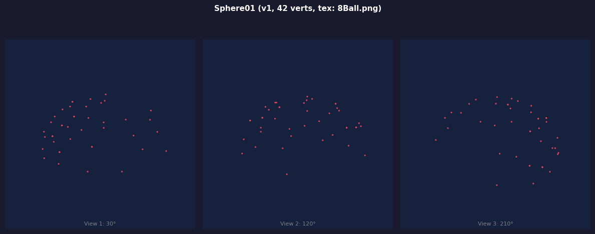 |
| 2 | Chomper | 6 | 0 |  | 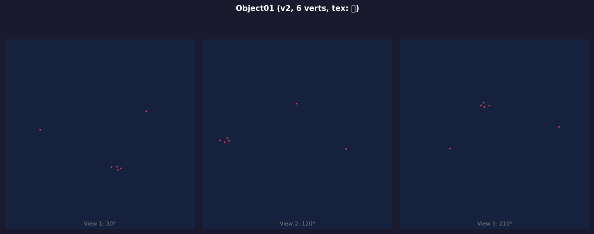 |
| 3 | Eye | 32 | 0 | PurpleEye.png | 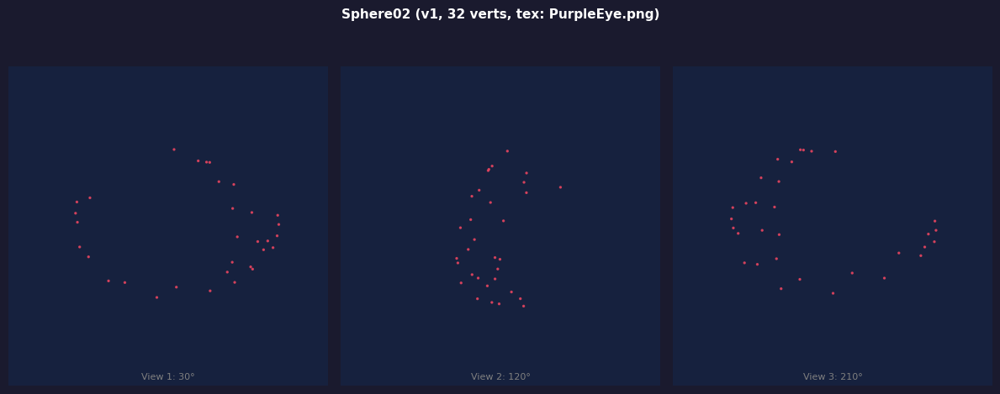 |
| 4 | FunBall | 42 | 0 | FunBall.png | 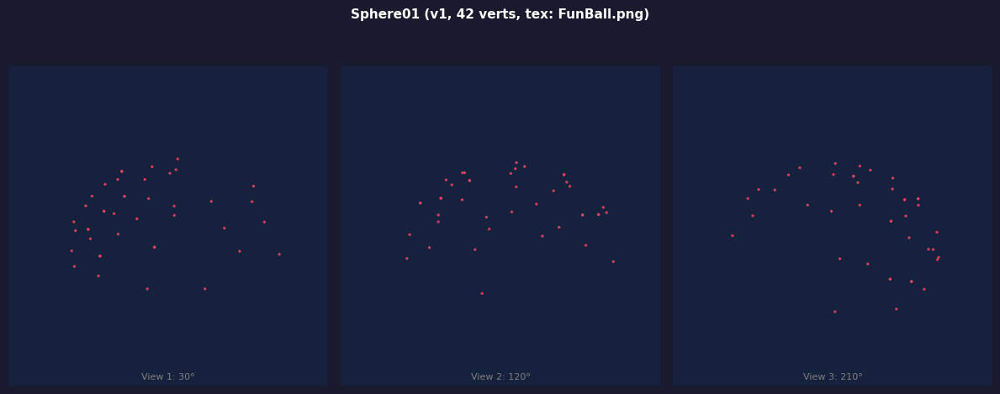 |
| 5 | GlassBonus | 26 | 0 | tenbonus.png | 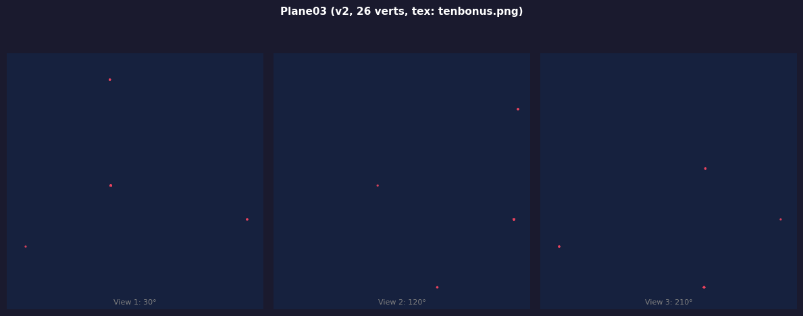 |
| 6 | Hamster-Trot1 | 122 | 0 | Hamster.jpg | 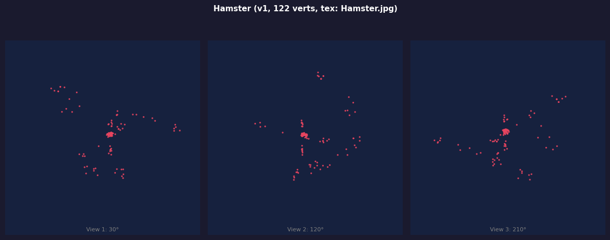 |
| 7 | Hamster-Trot2 | 112 | 0 | Hamster.jpg | 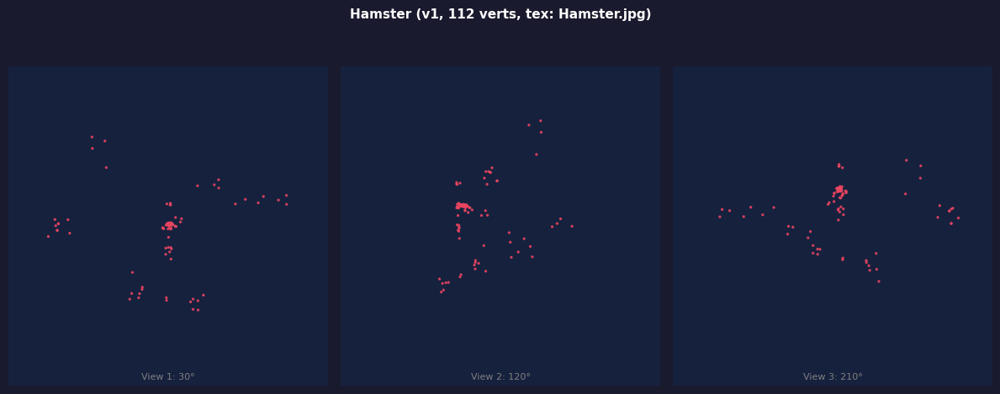 |
| 8 | Hamster-Trot3 | 117 | 0 | Hamster.jpg | 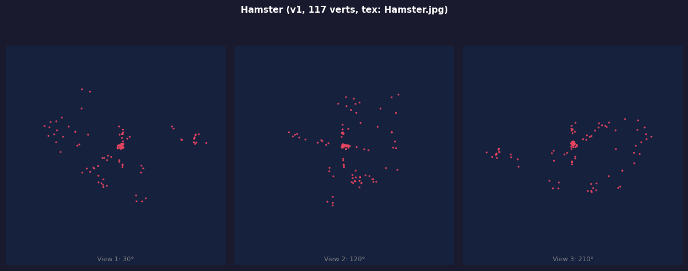 |
| 9 | Hamster-Waiting | 122 | 0 | Hamster.jpg | 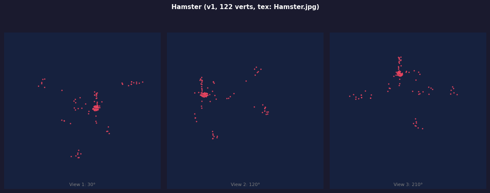 |
| 10 | Hamster | 119 | 0 | Hamster.jpg | 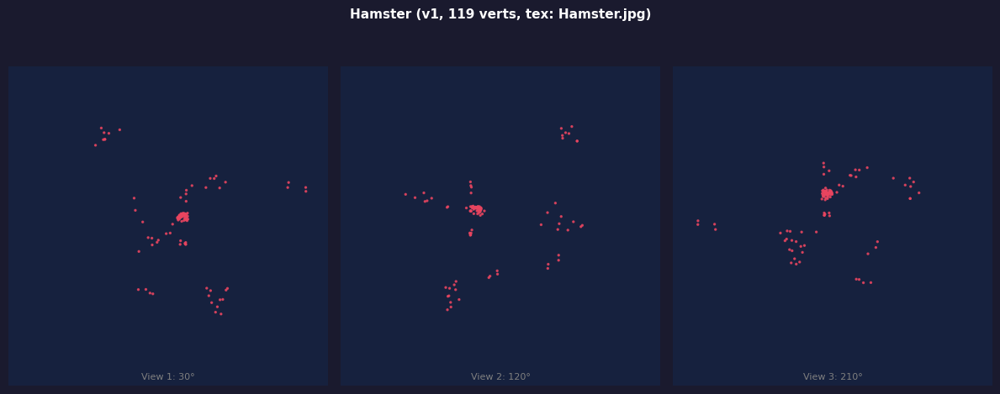 |
| 11 | Mouse | 243 | 0 | Hamm.png | 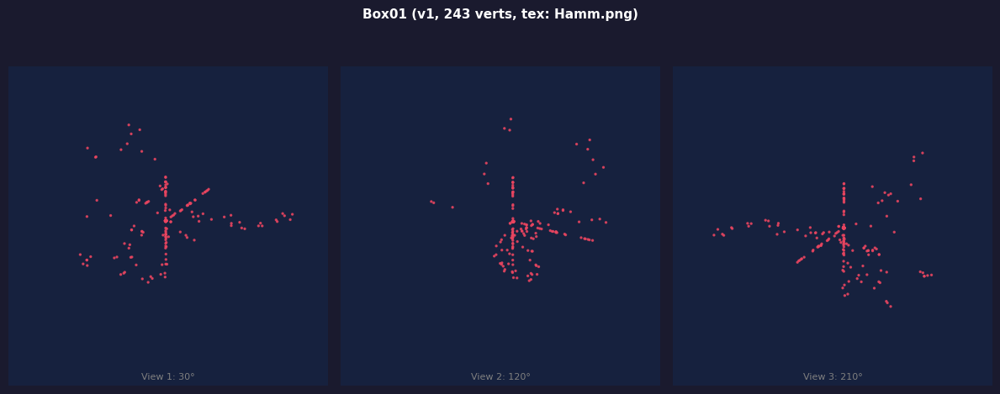 |
| 12 | RBGlare | 18 | 0 | Glare.png | 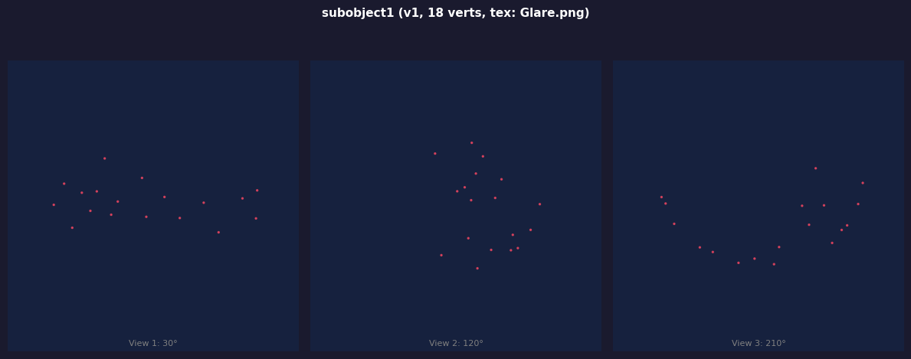 |
| 13 | Sawblade | 60 | 0 | sawblade.png | 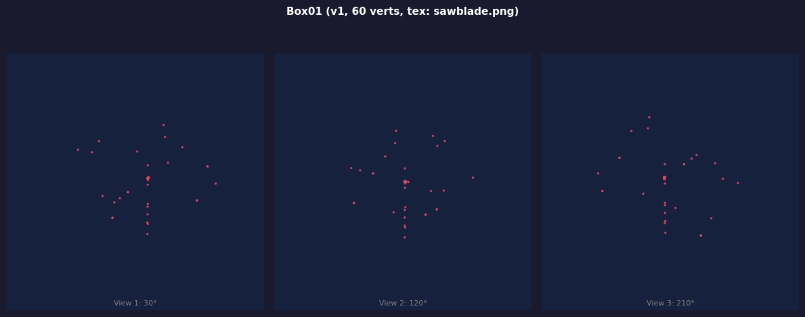 |
| 14 | Sphere+Tar | 19 | 0 | TarSplotch.png | 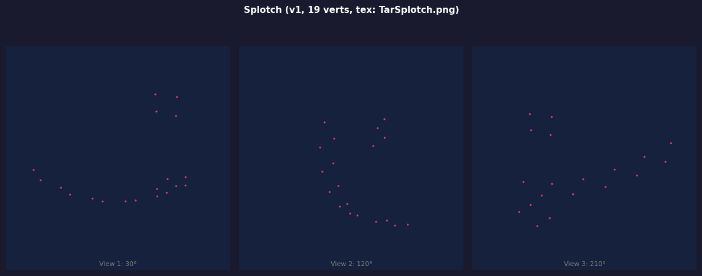 |
| 15 | Sphere | 59 | 0 | HamsterBall.png | 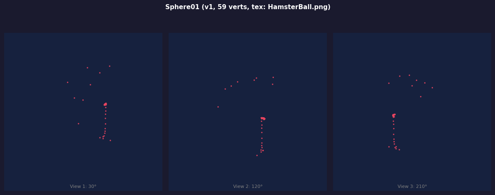 |
| 16 | SphereBreak1 | 38 | 0 | HamsterBall.png | 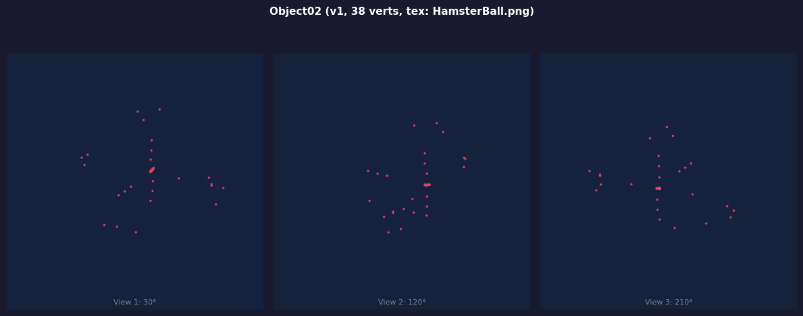 |
| 17 | SphereBreak2 | 26 | 0 | HamsterBall.png | 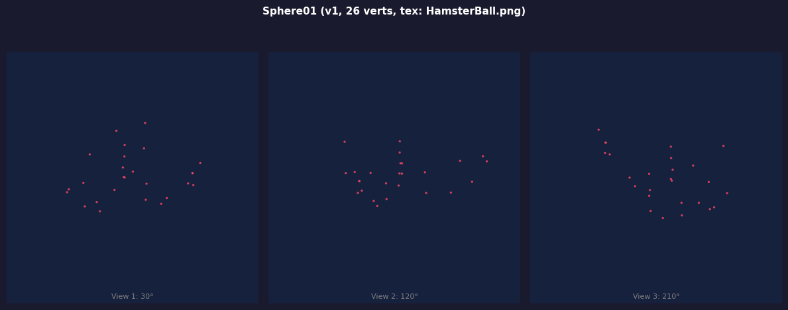 |
| 18 | TarBubble | 19 | 0 | TarBlot.png | 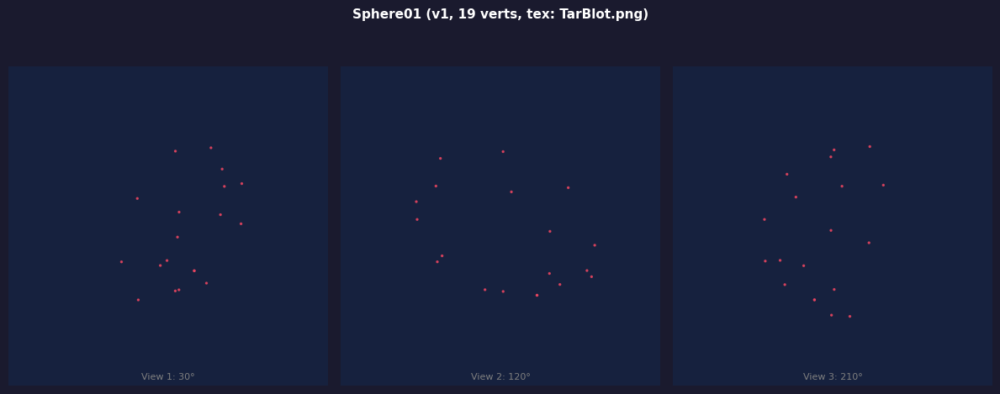 |
